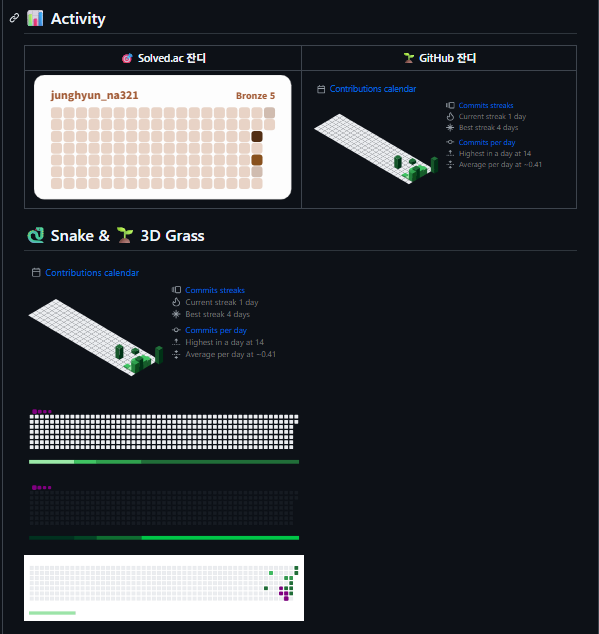

## 최종

<!-- 3D 잔디 -->

)

<!-- Snake 애니메이션 -->


---


## 1) PAT 만들기

> 개인 **GitHub 계정 프로필** 클릭 → **Settings → **좌측 최하단의 **Developer settings → Personal access tokens - Tokens(classic)** 

### 

1. **Generate new token (Classic)** 클릭
2. **Note**: METRICS_TOKEN
3. **Expiration**: 90일 / 커스텀
4. **Scopes(권한)** :
   - `repo` (푸시, 커밋 등 레포 콘텐츠 쓰기)
5. **Generate token** → 토큰 문자열 즉시 복사 (다시 못 봄)

> ⚠️ 토큰은 비밀입니다. 노출 금지(코드/로그/스크린샷에 넣지 않기).

------


## 2) 레포 Secret 등록

개인 레포지토리 페이지 → **Settings → Security → Secrets and variables → Actions → New repository secret**

- **Name**: `METRICS_TOKEN`  (대문자/언더스코어 권장)
- **Secret**: (방금 복사한 PAT 값 붙여넣기)
- **Add secret** 클릭

>  `Repository secrets`에 `METRICS_TOKEN`가 보이면 성공.

------


## 3) 워크플로우 파일 만들기

개인 레포지토리 - 상단의 `actions` 들어가서,

`set up a workflow yourself ` 클릭한다음,

`main.yml`에 아래 파일 복붙하기

### najung-h는 여러분의 아이디로 죄다 바꿔주세요

```markdown
name: Profile 3d grass and snake

on:
  schedule:
    - cron: "0 */6 * * *"   # (UTC) 6시간마다 실행
  workflow_dispatch:         # 수동 실행

# output 브랜치로 푸시하려면 repo 컨텐츠 쓰기 권한이 필요
permissions:
  contents: write

jobs:
  build:
    runs-on: ubuntu-latest

    steps:
      # 1) 저장소 체크아웃
      - name: Checkout repo
        uses: actions/checkout@v4

      # 1-1) dist 폴더 미리 생성 (중요!)
      - name: Prepare dist folder
        run: mkdir -p dist

      # 2) 입체 잔디 생성
      - name: Generate 3d grass
        uses: lowlighter/metrics@latest
        with:
          user: najung-h
          token: ${{ secrets.METRICS_TOKEN }}  # PAT 필요
          template: classic
          filename: dist/metrics-6m.svg   # dist 폴더에 저장
          base: ""
          config_timezone: Asia/Seoul
          plugin_isocalendar: yes
          plugin_isocalendar_duration: half-year

      # 3) 뱀 생성 
      - name: Generate snake
        uses: Platane/snk@v3
        id: snake-gif
        with:
          github_user_name: najung-h
          outputs: |
            dist/github-contribution-grid-snake.svg
            dist/github-contribution-grid-snake-dark.svg?palette=github-dark
            dist/github-contribution-grid-snake.gif

      # 상태 확인
      - name: Git status
        run: git status

      # 생성물 확인(옵션)
      - name: List dist
        run: ls -alh dist || true


      # 4) dist/ 를 output 브랜치로 배포
      - name: Deploy profile assets to output branch
        uses: crazy-max/ghaction-github-pages@v3
        with:
          target_branch: output
          build_dir: dist
          commit_message: "chore: update profile assets"
        env:
          GITHUB_TOKEN: ${{ secrets.GITHUB_TOKEN }}

      # 5) 동일 산출물을 기본 브랜치(master)의 dist/에도 커밋 (README가 master를 가리켜도 OK)
      - name: Commit dist to default branch
        uses: stefanzweifel/git-auto-commit-action@v5
        with:
          commit_message: "chore: sync dist assets to default branch"
          branch: master   # 기본 브랜치가 main이면 main으로 변경
          file_pattern: dist/**
```


---


## 4) 리드미에 붙여넣으세요

```markdown
## 🐍 Snake & 🌱 3D Grass

<!-- 3D 잔디 -->


<!-- Snake 애니메이션 -->


```


## 5) git add - git commit - git push 해봅시다.

이후, 

1. 레포 상단 메뉴에서 **Actions** 탭 클릭 
2. 왼쪽 사이드바에서 방금 만든 워크플로우 이름(`Profile 3d grass and snake`)을 선택
3. 오른쪽에 **“Run workflow”** 버튼이 있습니다.
   - 버튼을 누르면 `branch` 선택창이 나오는데 기본 브랜치(`master` 또는 `main`) 그대로 두고 실행
   - 초록색 **Run workflow** 클릭
   - 실행 성공 확인하기


# 이제, 새로고침 한 번 해주시면, README.md에 뱀이 돌아다닙니다.